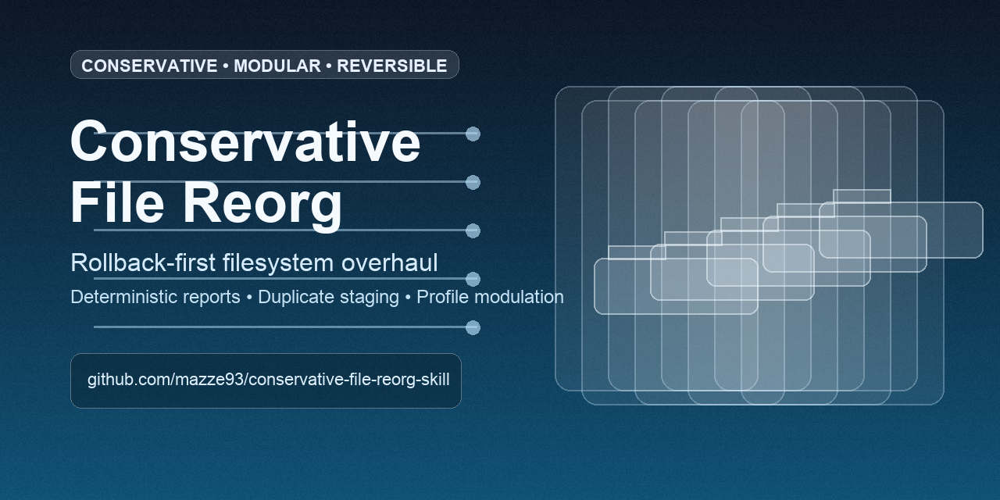

# Conservative File Reorg




A modular, context-aware file reorganization skill designed to be **safe first**, **low cognitive load**, and **fully inspectable**.

## Why this exists
Most folder cleanups fail in one of two ways:
- too manual to maintain
- too aggressive to trust

This project is built for the middle path:
- conservative by design
- deterministic where it matters
- reversible when mistakes happen

## Core promises
- No destructive cleanup by default
- Duplicate staging instead of deletion
- Explicit CSV reports for every run
- Append-only operation logs
- One-command rollback support
- Profile-based modulation instead of hardcoded behavior

## Fast start (ADHD-friendly)
1. `cd /Users/daedalus/Code/personal/conservative-file-reorg-skill/conservative-file-reorg`
2. Run `audit`.
3. Run `plan` and inspect `move_plan.csv` + `review_queue.csv`.
4. Run `apply` only after review.
5. Build rollback CSV.

```bash
python3 scripts/file_reorg.py audit --root /ABSOLUTE/ROOT --profile references/documents-default.toml --report-date 2026-02-22
python3 scripts/file_reorg.py plan --root /ABSOLUTE/ROOT --profile references/documents-default.toml --scope loose --report-date 2026-02-22
python3 scripts/file_reorg.py apply --root /ABSOLUTE/ROOT --profile references/documents-default.toml --scope loose --report-date 2026-02-22
python3 scripts/file_reorg.py build-rollback --root /ABSOLUTE/ROOT --profile references/documents-default.toml --report-date 2026-02-22
```

Undo if needed:

```bash
python3 scripts/file_reorg.py undo --rollback-csv /ABSOLUTE/ROOT/.docsys/reports/2026-02-22/rollback_from_apply_log.csv
```

## Profile modulation
Use profiles to adapt behavior for different roots without rewriting code.

Included profiles:
- `conservative-file-reorg/references/documents-default.toml`
- `conservative-file-reorg/references/generic-default.toml`

Generate a new profile:

```bash
python3 scripts/new_profile.py \
  --template generic \
  --root /ABSOLUTE/ROOT \
  --detect-protected \
  --profile-id my-root-profile \
  --description "Conservative profile for my root" \
  --output references/my-root-profile.toml
```

Then run with it:

```bash
python3 scripts/file_reorg.py plan --root /ABSOLUTE/ROOT --profile references/my-root-profile.toml --scope loose --report-date 2026-02-22
```

## Transparent outputs
Every run writes artifacts under:
- `/ABSOLUTE/ROOT/.docsys/reports/<date>/`

Key files:
- `inventory.csv`
- `exact_hash_duplicates.csv`
- `name_variant_candidates.csv`
- `move_plan.csv`
- `review_queue.csv`
- `apply.log`
- `rollback_from_apply_log.csv`
- `summary.json`

## GitHub social preview
To make repository link shares use the branded card:
1. Open repository `Settings`.
2. Open `General`.
3. In `Social preview`, upload `.github/social-preview.png`.

## Repository layout
- `conservative-file-reorg/SKILL.md`: Codex skill trigger + workflow contract
- `conservative-file-reorg/scripts/file_reorg.py`: audit/plan/apply/reclassify/rollback engine
- `conservative-file-reorg/scripts/new_profile.py`: profile generator helper
- `conservative-file-reorg/references/*.toml`: reusable configuration profiles
- `conservative-file-reorg/agents/openai.yaml`: skill UI metadata

## Install as local Codex skill
```bash
ln -sfn /Users/daedalus/Code/personal/conservative-file-reorg-skill/conservative-file-reorg /Users/daedalus/.codex/skills/conservative-file-reorg
```

## Design stance
This repo follows FILESYSTEM OVERHAUL principles:
- canonical project storage under `/Users/daedalus/Code`
- clear boundary between persistent configs and generated reports
- terminal-first reproducibility
- transparency and rollback over automation bravado

## License
MIT
